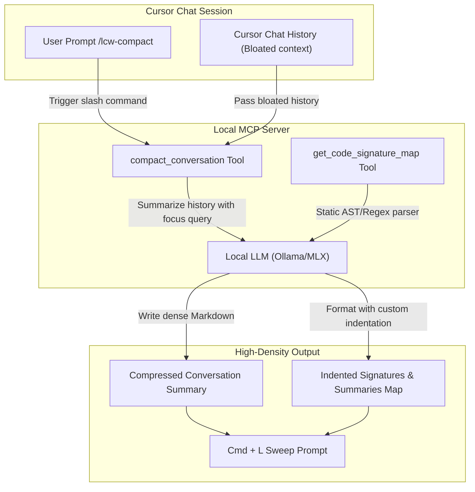

# Context Compaction and Codebase Signature Mapping Plan

This plan introduces two features to optimize Cursor's context window:
1.  **Codebase Signature Mapping (`get_code_signature_map` MCP Tool & `/lcw-map` slash command):** Generates a Python-indented summary tree of a file's global scope, classes, functions, and methods with brief local LLM-generated descriptions instead of loading full source files.
2.  **Guided Conversation Compaction (`compact_conversation` MCP Tool & `/lcw-compact` slash command):** Summarizes the active chat history using the local LLM, focusing on key architectural decisions (supporting user-specified focus areas) and providing a copyable clean-slate prompt for Cursor `Cmd + L` reset.

---

## 1. Architecture and Visual Concept



---

## 2. File Mapping

We will modify or create the following files:
*   `packages/schemas/src/index.ts` (Modify: Add input schemas for `local_compact_conversation` and `get_code_signature_map`)
*   `packages/mcp-server/src/signature-parser.ts` (Create: Hybrid static-and-LLM code signature parser supporting TypeScript, JavaScript, Python, etc.)
*   `packages/mcp-server/src/cli.ts` (Modify: Register the two new MCP tool schemas and their CallTool handlers)
*   `packages/mcp-server/src/index.ts` (Modify: Implement `localCompactConversation` and `getCodeSignatureMap` tool logic)
*   `packages/mcp-server/src/mcp-tools.test.ts` (Modify: Add unit tests for signature parsing and history compaction)
*   `.cursor/commands/lcw-compact.md` (Create: Slash command template for `/lcw-compact`)
*   `.cursor/commands/lcw-map.md` (Create: Slash command template for `/lcw-map`)
*   `packages/cursor-plugin/assets/commands/lcw-compact.md` (Create: Asset template)
*   `packages/cursor-plugin/assets/commands/lcw-map.md` (Create: Asset template)

---

## 3. High-Density Layout Contract (Python-Indented Style)

For signature mapping, the local LLM will format the parsed output using this token-efficient structure:

```text
packages/mcp-server/src/index.ts (Global: Core MCP server tool execution handlers and initialization)
  class WrapperTools (Collection of all exposed local workspace assistant tools)
    method refinePrompt(prompt: string, intent: string) --> Refines user prompt using Ollama
    method getContextHandoff() --> Reads active context-store handoff files
  function createWrapperTools(options: { store: ContextStore }) --> Instantiates tools collection
```

---

## 4. Implementation Steps (Bite-Sized Todos)

For the upcoming execution phase, we organize the work into these sequential tasks:
