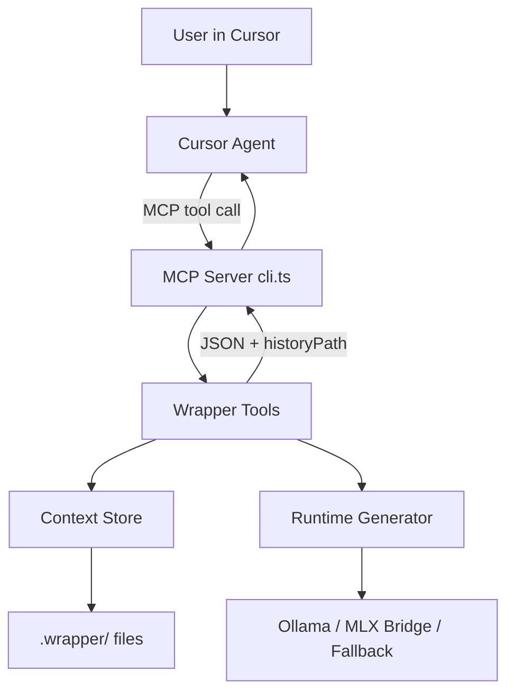

# Local Context Wrapper — Technical Reference

This document explains how the wrapper works internally: package boundaries, data flow, scoring logic, runtime selection, configuration knobs, and where outputs land. Use it when returning to this repo after a long gap or when wiring the sidecar into another project.

For setup steps, see [onboarding.md](./onboarding.md). For day-to-day usage, see [README.md](../README.md).

---

## 1. System purpose

The wrapper is a **Cursor-native sidecar**. It does not replace Cursor's hosted Agent/chat model. Instead it:

1. Maintains durable project context under `.wrapper/`
2. Scores rough user prompts for missing context (local LLM when configured; heuristics offline)
3. Calls a **local** model (Ollama Gemma 4 recommended) to refine prompts and assess quality in one JSON response
4. Persists refinement outputs with bounded history
5. Exposes tools to Cursor via MCP (Model Context Protocol)



---

## 2. Monorepo layout

| Package | Path | Responsibility |
|---------|------|----------------|
| `@wrapper/schemas` | `packages/schemas` | Zod schemas for handoff, decisions, prompt quality, model profile, workspace policy |
| `@wrapper/context-store` | `packages/context-store` | Read/write `.wrapper/` YAML/Markdown with atomic writes and prompt history retention |
| `@wrapper/model-router` | `packages/model-router` | Detect Mac hardware; recommend MLX tier (informational when using Ollama) |
| `@wrapper/mlx-runner` | `packages/mlx-runner` | Thin adapter interface for `generate({ system, prompt })` |
| `@wrapper/semantic-index` | `packages/semantic-index` | File walk, chunking, Ollama embeddings, lexical fallback, context retrieval |
| `@wrapper/mcp-server` | `packages/mcp-server` | MCP stdio server, runtime generator, setup, smoke CLI |
| `@wrapper/cursor-plugin` | `packages/cursor-plugin` | Manifest, rules, commands, hook guidance for Cursor packaging |

Entry points:

| Script | File | Purpose |
|--------|------|---------|
| `npm run mcp` | `packages/mcp-server/src/cli.ts` | Long-running MCP sidecar for Cursor |
| `npm run setup:workspace` | `packages/mcp-server/src/setup-workspace-cli.ts` | Initialize or upgrade `.wrapper/` in a project |
| `npm run setup:cursor` | `packages/mcp-server/src/setup-cursor-cli.ts` | Install `.cursor/mcp.json`, rules, and slash commands |
| `npm run smoke:refine` | `packages/mcp-server/src/smoke.ts` | One-shot refinement without MCP client |
| `npm run smoke:index` | `packages/mcp-server/src/smoke-index.ts` | One-shot workspace indexing |
| `npm run smoke:brief` | `packages/mcp-server/src/smoke-brief.ts` | One-shot agent brief generation |

---

## 3. `.wrapper/` directory contract

Each **target project** (not necessarily this repo) gets a `.wrapper/` folder.

```
.wrapper/
├── context/
│   ├── current.yaml          # Structured handoff (source of truth)
│   ├── handoff.md            # Human-readable mirror of current.yaml
│   ├── decisions.yaml        # Accepted architectural decisions
│   └── runtime-profile.yaml  # Last detected hardware + MLX tier recommendation
├── policy.yaml               # Indexing, privacy, prompt history settings
├── specs/                    # PRDs / requirements (manual)
├── prompts/                  # Timestamped refinement outputs (git-ignored)
├── runs/                     # Task-scoped agent briefs (git-ignored)
└── index/                    # Local semantic/lexical index (git-ignored)
```

### Git policy (decided default)

| Path | In git? | Why |
|------|---------|-----|
| `context/current.yaml`, `handoff.md`, `decisions.yaml`, `runtime-profile.yaml` | Yes (recommended) | Reviewable project memory |
| `policy.yaml` | Yes (recommended) | Team-visible retention/index rules |
| `prompts/`, `runs/`, `index/` | No | Generated/noisy; avoid bloating Cursor project search |

Configured in root `.gitignore`:

```
.wrapper/index/
.wrapper/runs/
.wrapper/prompts/
```

---

## 4. End-to-end: `refine_prompt`

This is the core flow. Pseudocode mirrors `packages/mcp-server/src/index.ts`, `prompt-assessment.ts`, and `runtime-generator.ts`.

```
function refinePrompt(userPrompt, intent):
  handoff = store.readHandoff()

  assessment = runtime.assessAndRefine({ handoff, prompt: userPrompt, intent })

  result = {
    version: 1,
    prompt: userPrompt,
    score: assessment.score,
    missingContext: assessment.missingContext,
    recommendedQuestions: assessment.recommendedQuestions,
    refinedPrompt: assessment.refinedPrompt,
    scoringMethod: assessment.scoringMethod,      // "llm" | "heuristic"
    readyForImplementation: assessment.readyForImplementation,
    createdAt: now()
  }

  historyPath = store.recordPromptResult(result)
  return { ...result, historyPath }
```

When Ollama or the MLX bridge is active (`WRAPPER_RUNTIME=ollama` or `mode: bridge`), **one local LLM call** returns score, gaps, questions, and refined prompt as JSON. Heuristic regex scoring is used only when no local runtime is configured or JSON parsing fails.

### 4.1 Missing-context detection

**Primary path (LLM):** The local model returns `missingContext` labels in structured JSON (e.g. `goal`, `success criteria`, `constraints`, `scope`, `detail`).

**Fallback path (heuristic):** Regex + word count in `assessPromptHeuristically()` when no LLM backend is available:

| Gap | Trigger (simplified) |
|-----|----------------------|
| `goal` | No keywords: goal, purpose, why, outcome, intention |
| `success criteria` | No keywords: acceptance, done, success, criteria, test, verify |
| `constraints` | No keywords: constraint, must, should, do not, cursor, local, runtime |
| `detail` | Fewer than 8 words in prompt |

**Tweak:** Edit regex lists in `prompt-assessment.ts` (`findMissingContextHeuristic`) for fallback-only behavior.

### 4.2 Prompt quality score

**Primary path (LLM):** Score 0–100 from the local model using rubric in `buildRefinementPrompt()` / `buildAssessmentPrompt()`:

| Range | Meaning |
|-------|---------|
| 0–39 | Vague; missing goal, scope, or success criteria |
| 40–69 | Workable but important gaps remain |
| 70–89 | Clear enough to implement with minor assumptions |
| 90–100 | Specific goal, constraints, acceptance criteria, verification |

The model also sets `readyForImplementation` (true when score ≥ 70 and no critical gaps).

**Fallback path (heuristic):** Used only without a local runtime:

```
score = clamp(0, 100, min(70, words × 5) + 30 − gaps × 12)
```

**Tweak:** Adjust rubric text in `prompt-assessment.ts` for LLM scoring, or heuristic weights in `scorePromptHeuristic()` for offline fallback.

### 4.3 Recommended questions

**LLM path:** Returned in the same JSON payload as scoring.

**Heuristic fallback:** Maps each missing gap to a template in `recommendQuestionsHeuristic()`. For `intent === "implementation"`, adds a clarifying-before-coding question.

### 4.4 `score_prompt_quality` vs `refine_prompt`

| Tool | LLM calls | Rewrites prompt? |
|------|-----------|------------------|
| `refine_prompt` | 1 (JSON: score + refine) | Yes |
| `score_prompt_quality` | 1 (JSON: score only) | No — returns original prompt as `refinedPrompt` |

---

## 5. Runtime generator (local model path)

File: `packages/mcp-server/src/runtime-generator.ts`

The generator implements a **priority chain**:

```
if WRAPPER_RUNTIME=ollama (or mode=ollama):
  try Ollama HTTP API → on failure append fallback + error
else if mode=bridge and bridge command configured:
  try MLX subprocess bridge → on failure append fallback + error
else:
  deterministic fallback (no real model)
```

### 5.1 Ollama mode (recommended production path)

```
POST {OLLAMA_HOST}/api/generate
{
  "model": WRAPPER_OLLAMA_MODEL,   // default: gemma4:12b-mlx
  "prompt": "System instructions: ...\n\nUser request: ...\n\nReturn only the refined prompt text.",
  "stream": false
}
```

Returns `response` field as refined text.

**Why Ollama:** Avoids Hugging Face TLS/auth issues; model managed by `ollama pull`.

### 5.2 MLX bridge mode

Spawns a subprocess (no shell) with JSON on stdin:

```json
{
  "modelId": "mlx-community/gemma-3-4b-it-4bit",
  "system": "...",
  "prompt": "..."
}
```

Bridge script: `scripts/mlx_generate.py`

```python
# Simplified flow
payload = json.loads(sys.stdin.read())
model, tokenizer = mlx_lm.load(payload["modelId"])
prompt = tokenizer.apply_chat_template([system, user], ...)
output = mlx_lm.generate(model, tokenizer, prompt, max_tokens, temp)
print(output)  # stdout only
```

Model is cached in `_MODEL_CACHE` for the process lifetime.

### 5.3 Fallback mode

When no runtime is available or call fails:

```
Refined prompt:
{original composed prompt}

Model recommendation: {modelId}
Fallback mode active: ...
Bridge error: {message}   // if bridge/ollama failed
```

Still useful for testing scoring/history without a model.

---

## 6. Context store

File: `packages/context-store/src/index.ts`

### 6.1 Initialization

`store.initialize({ projectName, projectGoal })` creates folder structure and default files. Called when handoff is missing (first run).

### 6.2 Atomic writes

All YAML/Markdown writes use temp file + rename:

```
write temp:  {path}.{pid}.{timestamp}.tmp
rename temp → final path
mode: 0o600
```

Prevents partial reads during concurrent access.

### 6.3 Policy merge

`readPolicy()` merges saved `policy.yaml` with defaults. `ensurePolicy()` rewrites merged policy (used during setup to add new fields like `promptHistory` to older workspaces).

### 6.4 Prompt history retention

On each refinement, `recordPromptResult()`:

1. Reads `policy.promptHistory`
2. If disabled → returns `""` (no file)
3. Writes `{timestamp}-score-{score}.md` under `.wrapper/prompts/`
4. Lists all `.md` files, sorted lexicographically
5. Deletes oldest files until count ≤ `maxEntries`

```typescript
// Filename example
// 2026-06-15T16-49-54-563Z-score-76.md

const overflow = files.length - maxEntries;
await Promise.all(files.slice(0, overflow).map(rm));
```

Lexicographic sort works because ISO timestamps use zero-padded fields.

**Tweak:** Change `promptHistory.maxEntries` in `.wrapper/policy.yaml` (default: 20).

---

## 7. Workspace setup

File: `packages/mcp-server/src/setup-workspace.ts`

```
setupWorkspace(projectRoot):
  if no handoff exists:
    store.initialize(projectName from basename, default goal)
  store.ensurePolicy()                    // migrate policy fields
  profile = recommendModelProfile()       // hardware detection
  write .wrapper/context/runtime-profile.yaml
  return { workspaceRoot, profile }
```

CLI accepts optional path argument:

```bash
npm run setup:workspace -- /path/to/other/project
```

Environment alternative:

```bash
WRAPPER_WORKSPACE_ROOT=/path/to/project npm run setup:workspace
```

---

## 8. Model router (informational)

File: `packages/model-router/src/index.ts`

Detects:

- `platform`, `arch`, `memoryGb`, `cpuBrand`

Tier selection (Apple Silicon only):

| Unified memory | Tier | Default MLX model ID |
|--------------|------|----------------------|
| < 16 GB | `base` | `mlx-community/gemma-3-1b-it-4bit` |
| 16–31 GB | `standard` | `mlx-community/gemma-3-4b-it-4bit` |
| ≥ 32 GB | `pro` | `mlx-community/gemma-3-12b-it-4bit` |
| Non arm64/darwin | `fallback` | `external-runtime-required` |

When using Ollama, this tier is **advisory** (written to `runtime-profile.yaml`). Actual generation uses `WRAPPER_OLLAMA_MODEL`.

**Tweak:** Edit `modelByTier` map or thresholds in `selectTier()`.

---

## 9. MCP server tools

File: `packages/mcp-server/src/cli.ts`

| Tool | Behavior |
|------|----------|
| `refine_prompt` | Full refinement pipeline; LLM score + rewrite; returns JSON with `historyPath` |
| `score_prompt_quality` | LLM assessment only; does not rewrite the prompt |
| `get_context_handoff` | Returns `current.yaml` structure |
| `update_context_handoff` | Updates summary, focus, constraints, nextSteps |
| `get_runtime_profile` | Workspace root, hardware profile, active generator mode |
| `index_workspace` | Rebuilds the codebase semantic/lexical search index |
| `retrieve_context` | Performs semantic search and retrieves contextual chunks |
| `build_agent_brief` | Generates a task-scoped BRIEF for agent execution guidance |
| `diagnose_setup` | Verifies the health and readiness of services (Ollama, models, venvs) |
| `local_draft_plan` | (New in v2) Generates a draft task plan with structured milestones (Use in Plan Mode) |
| `local_execute_milestone` | (New in v2) Executes milestones through the routing contract (direct local / decomposed local / explicit hosted opt-out) |
| `local_file_read` | (New in v2) Enforces raw-read thresholds and returns projection-first outputs with cache reuse |
| `local_refresh_docs` | (New in v2) Refreshes docs using `smart_touched` or `full` scope from active plan context |
| `local_git_hygiene` | (New in v2) Prepares or creates safe hygiene commits (plan-scoped or all tracked) |
| `local_compact_conversation` | (New in v2) Summarizes and compacts active chat history to mitigate token bloat |
| `get_code_signature_map` | (New in v2) Generates high-density, Python-indented class/function logic signature trees |

MCP transport: **stdio** (`StdioServerTransport`). Process exits when stdin closes (no client attached).

Cursor wiring and on-demand invocation are documented in [§10 Cursor integration](#10-cursor-integration-on-demand).

During development, `tsx packages/mcp-server/src/cli.ts` works via `npm run mcp` or `bash scripts/run-mcp.sh`.

---

## 10. Cursor integration (on-demand)

Refinement is **not automatic**. The local model runs only when you invoke it.

### 10.1 What is wired in this repo

| Path | Role |
|------|------|
| `.cursor/mcp.json` | Registers MCP server via `bash scripts/run-mcp.sh` |
| `scripts/run-mcp.sh` | Sets default env (`WRAPPER_RUNTIME=ollama`, `gemma4:12b-mlx`) and starts `tsx .../cli.ts` |
| `.cursor/rules/local-context-wrapper.mdc` | Agent rule: do **not** auto-refine; use tools on request |
| `.cursor/commands/lcw-refine.md` | `/lcw-refine` → call `refine_prompt` |
| `.cursor/commands/lcw-handoff.md` | `/lcw-handoff` → call `update_context_handoff` |
| `.cursor/commands/lcw-brief.md` | `/lcw-brief` → call `build_agent_brief` |
| `.cursor/commands/lcw-index.md` | `/lcw-index` → call `index_workspace` |
| `.cursor/commands/lcw-auto.md` | `/lcw-auto` → calls `local_draft_plan` to initiate granular hybrid workflow |
| `.cursor/commands/lcw-compact.md` | `/lcw-compact` → MCP-gated `local_compact_conversation` (verify MCP availability first) |
| `.cursor/commands/lcw-map.md` | `/lcw-map` → call `get_code_signature_map` to map a file's code signatures |
| `.cursor/commands/lcw-docs.md` | `/lcw-docs` → call `local_refresh_docs` for doc hygiene |
| `.cursor/commands/lcw-git.md` | `/lcw-git` → call `local_git_hygiene` for git hygiene |
| `.cursor/commands/lcw-fileread.md` | `/lcw-fileread` → call `local_file_read` for threshold-guarded reads and projection cache |

After editing MCP config, reload the Cursor window so the sidecar connects.

### 10.2 MCP config (this repo)

```json
{
  "mcpServers": {
    "local-context-wrapper": {
      "command": "bash",
      "args": ["scripts/run-mcp.sh"]
    }
  }
}
```

`run-mcp.sh` resolves `WRAPPER_WORKSPACE_ROOT` to the repo root unless overridden.

### 10.3 MCP config (another project)

Run from the wrapper repo:

```bash
npm run setup:cursor -- /path/to/your/project
```

Generated `.cursor/mcp.json` uses an **absolute** path to `scripts/run-mcp.sh` and sets:

```json
"env": {
  "WRAPPER_WORKSPACE_ROOT": "/path/to/your/project",
  "WRAPPER_RUNTIME": "ollama",
  "WRAPPER_OLLAMA_MODEL": "gemma4:12b-mlx",
  "OLLAMA_HOST": "http://127.0.0.1:11434"
}
```

Also run `npm run setup:workspace -- /path/to/your/project` so `.wrapper/` exists.

### 10.4 How to invoke refinement

| Method | When to use |
|--------|-------------|
| `/lcw-refine` | In Cursor chat; Agent calls MCP `refine_prompt` |
| `/lcw-handoff` | After a session milestone; updates context files |
| `npm run smoke:refine -- "..."` | Terminal-only; no MCP client needed |
| Ask Agent to call `refine_prompt` | Same as slash command if MCP is connected |

Outputs land in `.wrapper/prompts/{timestamp}-score-{n}.md` when `promptHistory.enabled` is true.

### 10.5 `/lcw-compact` safety gate (order of checks)

To prevent token blowups and false-root-cause debugging:

1. **MCP availability first:** verify `local-context-wrapper` is connected and `local_compact_conversation` is callable in the active Cursor session.
2. **Fail fast if unavailable:** stop and return reconnection/setup steps (reload Cursor, re-run `setup:cursor`, validate `.cursor/mcp.json`).
3. **Runtime checks second:** only after MCP is confirmed, diagnose Ollama/model readiness if compaction still fails.
4. **No broad debugging loops pre-gate:** do not run repo-wide diagnostics/tests when the MCP availability gate has not passed.

### 10.6 Manual MCP override

For custom env without editing `run-mcp.sh`:

```json
{
  "mcpServers": {
    "local-context-wrapper": {
      "command": "bash",
      "args": ["/absolute/path/to/Wrapper/scripts/run-mcp.sh"],
      "env": {
        "WRAPPER_WORKSPACE_ROOT": "/path/to/project",
        "WRAPPER_RUNTIME": "ollama",
        "WRAPPER_OLLAMA_MODEL": "gemma4:12b-mlx"
      }
    }
  }
}
```

Development alternative (same as `npm run mcp`):

```bash
WRAPPER_RUNTIME=ollama WRAPPER_OLLAMA_MODEL=gemma4:12b-mlx npm run mcp
```

---

## 11. Cursor plugin package (source assets)

File: `packages/cursor-plugin/`

Assets under `packages/cursor-plugin/assets/` mirror committed `.cursor/` content:

- `rules/local-context-wrapper.mdc` — opt-in guidance (not auto-refine on every message)
- `commands/lcw-refine.md`, `lcw-handoff.md` — slash command templates
- `hooks/README.md` — guardrail notes (warn, don't rewrite built-in chat)

Install into another project with `npm run setup:cursor -- /path/to/project`.

The manifest explicitly **does not** claim `rewriteBuiltInChatPrompt` capability.

---

## 12. Configuration reference

### 12.1 Environment variables

| Variable | Default | Effect |
|----------|---------|--------|
| `WRAPPER_WORKSPACE_ROOT` | `process.cwd()` | Which project owns `.wrapper/` |
| `WRAPPER_RUNTIME` | unset | Set to `ollama` to enable Ollama path in auto mode |
| `WRAPPER_OLLAMA_MODEL` | `gemma4:12b-mlx` | Ollama model tag |
| `WRAPPER_OLLAMA_NUM_CTX` | `65536` | Max context tokens passed to Ollama on every generate call; oversized loaded models are unloaded automatically |
| `OLLAMA_HOST` | `http://127.0.0.1:11434` | Ollama API base URL |
| `WRAPPER_MLX_COMMAND_JSON` | auto-detect `scripts/mlx_generate.py` | JSON array: `["python","/path/to/mlx_generate.py"]` |
| `WRAPPER_MODEL_ID_OVERRIDE` | hardware tier default | Force MLX model ID or local model directory |
| `WRAPPER_MLX_MAX_TOKENS` | `256` | MLX bridge max tokens |
| `WRAPPER_MLX_TEMPERATURE` | `0.2` | MLX bridge temperature |

### 12.2 `.wrapper/policy.yaml`

```yaml
version: 1
indexing:
  enabled: true
  include: ["**/*"]
  exclude:
    - .env
    - .env.*
    - node_modules/**
    - .git/**
    - .wrapper/index/**
    - .wrapper/runs/**
privacy:
  allowPromptLogs: false
  redactSecrets: true
promptHistory:
  enabled: true
  directory: .wrapper/prompts
  maxEntries: 20
hygiene:
  enabled: true
  autoDocUpdate: true
  docScope: smart_touched
  autoCommitOnPlanComplete: true
  autoPush: false
  commitMode: plan_scoped
  promptThresholds:
    milestones: 5
    changedLines: 200
contextManagement:
  zeroHistoryReset: true
  resetStrategy: clear_history
  directorRawReadMaxLines: 50
  useCheapHostedWorkerForProjections: true
  useCheapHostedWorkerWhenOllamaUnavailable: true
```

| Field | Tweak effect |
|-------|--------------|
| `promptHistory.enabled` | `false` stops writing prompt files |
| `promptHistory.maxEntries` | Retention cap; oldest deleted first |
| `promptHistory.directory` | Alternate output folder (relative to project root) |
| `hygiene.autoDocUpdate` | Auto-run docs hygiene when plan is completed |
| `hygiene.docScope` | `smart_touched` for selective docs or `full` for full refresh |
| `hygiene.autoCommitOnPlanComplete` | Auto-create hygiene commit after successful plan |
| `hygiene.autoPush` | Keep `false`; pushes still require explicit approval |
| `hygiene.promptThresholds` | Adds interim `/lcw-docs` + `/lcw-git` prompts on long runs |
| `contextManagement.directorRawReadMaxLines` | Caps direct hosted-agent raw reads per window (default `50`) |
| `contextManagement.useCheapHostedWorkerForProjections` | Enables cheap hosted projection worker for non-code/broad artifacts |
| `contextManagement.useCheapHostedWorkerWhenOllamaUnavailable` | Forces cheap hosted projection fallback when Ollama is unavailable |
| `indexing.exclude` | Future semantic index ignore list |
| `privacy.allowPromptLogs` | Reserved for future `.wrapper/runs/` logging |

### 12.3 Handoff file (`.wrapper/context/current.yaml`)

Updated by `update_context_handoff` MCP tool or manual edit. Fields:

- `project.name`, `project.goal`
- `activeContext.summary`, `currentFocus`, `constraints[]`, `nextSteps[]`
- `signals.confidence`, `signals.staleAfterMinutes`

`handoff.md` is regenerated automatically on every update.

---

## 13. Where to see outputs

| Output | Location | How to open |
|--------|----------|-------------|
| Latest refinement file | `.wrapper/prompts/{timestamp}-score-{n}.md` | Returned as `historyPath` in JSON; open in editor |
| Structured handoff | `.wrapper/context/current.yaml` | MCP `get_context_handoff` or direct read |
| Human handoff | `.wrapper/context/handoff.md` | Good for Cursor `@` reference or session start |
| Smoke test JSON | Terminal stdout | `npm run smoke:refine -- "..."` |
| MCP tool JSON | Cursor tool result panel | Call `refine_prompt` from Agent |

Example prompt history file structure:

```markdown
---
createdAt: 2026-06-15T16:49:54.563Z
score: 76
---

# Prompt Refinement

## Original Prompt
...

## Missing Context
- goal
- success criteria

## Recommended Questions
- What outcome should the working model optimize for?
...

## Refined Prompt
...
```

---

## 14. Schema validation

All persisted structures pass Zod schemas in `packages/schemas/src/index.ts`. Invalid data throws at read/write time rather than silently corrupting `.wrapper/`.

Key types:

- `ContextHandoff` — version 1, ISO datetime fields
- `PromptQuality` — score 0–100, optional `historyPath`
- `WorkspacePolicy` — includes `promptHistory` block (required after `ensurePolicy()`)
- `ModelProfile` — tier enum: base | standard | pro | fallback

---

## 15. Testing map

| Test file | Covers |
|-----------|--------|
| `packages/schemas/src/schemas.test.ts` | Schema validation |
| `packages/context-store/src/context-store.test.ts` | Init, handoff updates, prompt history pruning |
| `packages/model-router/src/model-router.test.ts` | Tier selection |
| `packages/mcp-server/src/mcp-tools.test.ts` | Refinement + historyPath |
| `packages/mcp-server/src/runtime-generator-ollama.test.ts` | Ollama success/fallback |
| `packages/mcp-server/src/runtime-generator-bridge.test.ts` | MLX bridge failure fallback |
| `packages/mcp-server/src/setup-workspace.test.ts` | Setup creates policy + runtime profile |

Run all: `npm test`

---

## 16. Common tweaks (quick index)

| Goal | Where to change |
|------|-----------------|
| Use Gemma 4 via Ollama | `WRAPPER_RUNTIME=ollama`, `WRAPPER_OLLAMA_MODEL=gemma4:12b-mlx` |
| Use smaller/faster Ollama model | `WRAPPER_OLLAMA_MODEL=gemma4:e2b` |
| Keep fewer prompt files | `.wrapper/policy.yaml` → `promptHistory.maxEntries: 5` |
| Disable prompt file writes | `promptHistory.enabled: false` |
| Stricter prompt scoring | Edit rubric in `buildRefinementPrompt()` / `buildAssessmentPrompt()` |
| Heuristic fallback tuning | Edit `scorePromptHeuristic()` in `prompt-assessment.ts` |
| Different missing-context rules (fallback) | Edit `findMissingContextHeuristic()` in `prompt-assessment.ts` |
| Wire Cursor for another project | `npm run setup:cursor -- /path/to/project` |
| Point MCP at another repo | `WRAPPER_WORKSPACE_ROOT=/path/to/project` in `.cursor/mcp.json` env |
| Force MLX model | `WRAPPER_MODEL_ID_OVERRIDE=/local/model/path` |
| Change refinement system prompt | Edit `refinePrompt()` system string in `mcp-server/src/index.ts` |
| Add new MCP tool | Register in `cli.ts` ListTools + CallTool handlers |

---

## 17. Known constraints

1. **No transparent Cursor chat rewrite** — supported surfaces only (MCP, rules, commands, hooks).
2. **Refinement is opt-in** — `/lcw-refine`, `smoke:refine`, or explicit MCP calls; normal chat is not auto-refined.
3. **Cursor main model stays hosted** — local model refines prompts; Cursor Agent still uses its configured model for coding.
4. **Prompt history git-ignored** — reduces accidental inclusion in project-wide search; open files explicitly when needed.
5. **MLX router vs Ollama** — hardware tier recommends MLX IDs; production path uses Ollama model tags independently.
6. **Heuristic scoring is fallback-only** — when Ollama/MLX is configured, score and gaps come from local LLM JSON.

---

## 18. File index (source of truth)

```
packages/
├── schemas/src/index.ts           # Zod schemas
├── context-store/src/index.ts       # .wrapper/ persistence
├── model-router/src/index.ts        # Hardware tier logic
├── mlx-runner/src/index.ts          # Generate function adapter
├── semantic-index/src/
│   ├── index.ts                     # File walk, chunking, retrieval
│   └── embeddings.ts                # Ollama embeddings + cosine similarity
├── mcp-server/src/
│   ├── index.ts                     # Wrapper tools (refine, handoff, index, brief)
│   ├── prompt-assessment.ts         # LLM/heuristic scoring + JSON parsing
│   ├── runtime-generator.ts         # Ollama / MLX / fallback
│   ├── cli.ts                       # MCP stdio server
│   ├── setup-workspace.ts           # Project bootstrap
│   ├── setup-cursor-cli.ts          # Cursor MCP + rules installer
│   ├── smoke.ts                     # CLI smoke test (refine)
│   ├── smoke-index.ts               # CLI smoke test (index)
│   └── smoke-brief.ts               # CLI smoke test (brief)
└── cursor-plugin/                   # Cursor packaging assets
scripts/
├── run-mcp.sh                       # MCP launcher (Ollama defaults)
└── mlx_generate.py                  # MLX subprocess bridge
.cursor/
├── mcp.json                         # Project MCP registration
├── rules/local-context-wrapper.mdc
└── commands/                        # /lcw-refine, /lcw-handoff, /lcw-brief, /lcw-index, /lcw-auto
```

---

## 19. Semantic indexing

The `@wrapper/semantic-index` package implements local codebase indexing and retrieval:

1. **File Walk**: Walks the target workspace recursively, respecting `policy.indexing.include` and `policy.indexing.exclude` patterns using `minimatch`.
2. **Binary & Size Checks**: Skips binary files (detected by checking for null bytes in the first 512 bytes) and files exceeding `policy.indexing.maxFileBytes` (default 256KB).
3. **Line-Aware Chunking**: Chunks text files into segments of approximately `policy.indexing.chunkCharSize` characters (default 1800) while strictly preserving whole lines. This ensures line metadata (`startLine`, `endLine`) is accurate.
4. **Ollama Embeddings**: Generates 1536-dimensional vectors for each chunk using Ollama's `POST /api/embeddings` (defaulting to the `nomic-embed-text` model).
5. **Lexical Fallback**: If Ollama is offline or the embedding model is missing, the index automatically falls back to **lexical mode**. Chunks are stored without embeddings, and retrieval uses a term-frequency overlap score.
6. **Atomic Storage**: Saves the index atomically to `.wrapper/index/manifest.json` and `chunks.json`.

---

## 20. Agent briefs

The `build_agent_brief` tool packages project context and retrieval hits into a task-specific brief:

1. **Context Assembly**: Reads the latest workspace handoff and accepted architectural decisions.
2. **Local Retrieval**: Queries the semantic/lexical index using the user's task to find the top-k relevant codebase snippets.
3. **Structured Brief Generation**: Sends the assembled context to the local model (Ollama) with instructions to generate a structured JSON brief containing:
   - `goal`: Clear description of what the agent must achieve.
   - `inScope`: Specific files and folders to modify.
   - `outOfScope`: Files or systems to avoid.
   - `constraints`: Architectural or product constraints.
   - `acceptanceCriteria`: Specific verification criteria.
   - `verificationSteps`: Step-by-step instructions to verify the work.
   - `firstStep`: The very first concrete action to take.
   - `briefMarkdown`: A rich, dense Markdown brief containing all of the above.
4. **History & Retention**: Saves the brief to `.wrapper/runs/{timestamp}-brief.md` and prunes history to keep only the latest entries (default 10), as configured in `.wrapper/policy.yaml`.
5. **Cursor Usage**: Users can reference the generated brief using `@` in a new chat or when launching a sub-agent. This keeps the hosted Agent highly focused, prevents hallucinations, and saves massive amounts of context tokens.

---

## 21. Command use cases & workflows

To maximize the value of the Local Context Wrapper, developers should follow these defined use cases and step-by-step workflows for each command.

### 21.1 `/lcw-index` (Workspace Indexing)

#### Defined Use Case
Keeping the local semantic and lexical search index synchronized with the codebase. This ensures that context retrieval is accurate and up-to-date.

#### When to use
- **Onboarding/Setup**: Immediately after setting up the workspace or checking out a new branch.
- **Upstream Updates**: After pulling the latest changes from the remote repository.
- **Major Code Changes**: After completing a major feature, refactoring a module, or adding new files.
- **Stale Retrieval**: When `/lcw-brief` retrieval hits feel outdated or miss recently added symbols.

#### Step-by-Step Workflow
1. **Trigger Indexing**:
   - **In Cursor**: Type `/lcw-index` in the chat.
   - **In Terminal**: Run `npm run smoke:index`.
2. **Directory Traversal**: The tool recursively walks the workspace root, filtering out binary files and paths matching the `exclude` list in `.wrapper/policy.yaml`.
3. **Chunking**: Text files are split into line-preserving segments of approximately 1800 characters.
4. **Vector Generation**: The tool attempts to generate 1536-dimensional embeddings for each chunk using Ollama's `nomic-embed-text` model.
   - *Fallback*: If Ollama is offline or the model is missing, the tool automatically switches to `lexical` mode, storing chunks without embeddings.
5. **Atomic Commit**: The manifest and chunks are written atomically to `.wrapper/index/manifest.json` and `chunks.json`.
6. **Confirmation**: The agent displays the indexing mode, total files processed, and chunk count.

---

### 21.2 `/lcw-refine` (Prompt Refinement)

#### Defined Use Case
Polishing a rough, short, or ambiguous prompt into a highly structured, spec-driven instruction before beginning a complex task.

#### When to use
- **Task Scoping**: When starting a non-trivial implementation, debugging, or planning task.
- **Gaps in Requirements**: When the developer has a general goal but hasn't specified acceptance criteria, constraints, or verification steps.
- **Preventing Guesswork**: To prevent the hosted Cursor Agent from guessing requirements or inventing API contracts.

#### Step-by-Step Workflow
1. **Submit Rough Prompt**:
   - **In Cursor**: Type `/lcw-refine <rough instruction>` (e.g., `/lcw-refine add a dark mode toggle`).
   - **In Terminal**: Run `npm run smoke:refine -- "<rough instruction>"`.
2. **Local Assessment**: The local model evaluates the prompt against the current context handoff (`.wrapper/context/current.yaml`) to identify missing requirements.
3. **Structured Response**: The local model generates a structured JSON payload containing:
   - A prompt quality score (0-100).
   - Identified missing context gaps (e.g., constraints, success criteria).
   - Recommended clarifying questions.
   - A refined, spec-driven version of the prompt.
4. **Review & Answer**:
   - If the score is low (e.g., < 80), the developer answers the recommended questions.
   - The developer can submit the updated prompt for another round of refinement.
5. **Execution**: Once the prompt is fully refined, the developer copies the refined text and feeds it to the hosted Cursor Agent to begin coding.
6. **History**: The result is saved to `.wrapper/prompts/{timestamp}-score-{n}.md` for future reference.

---

### 21.3 `/lcw-handoff` (Context Handoff)

#### Defined Use Case
Capturing the current state of the project (progress, focus, constraints, next steps) to maintain durable memory across separate chat sessions or developers.

#### When to use
- **Session End**: At the end of a long-running chat session or coding sprint.
- **Milestone Reached**: After successfully completing a major step in the implementation plan.
- **Context Switching**: Before closing the editor, starting a fresh Cursor chat, or handing the workspace off to another developer.

#### Step-by-Step Workflow
1. **Trigger Handoff**: Type `/lcw-handoff` in the Cursor chat.
2. **Progress Synthesis**: The hosted Agent summarizes the recent changes and progress made in the current session.
3. **MCP Call**: The Agent calls the `update_context_handoff` MCP tool with the updated fields:
   - `summary`: Concise summary of what has been built.
   - `currentFocus`: What the developer/agent is currently working on.
   - `constraints`: Active architectural or product constraints.
   - `nextSteps`: Clear, actionable next steps.
4. **Durable Persistence**: The tool writes the updated state to `.wrapper/context/current.yaml` and renders a human-readable mirror to `.wrapper/context/handoff.md`.
5. **Git Commit**: The developer commits these changes to Git. This ensures that the project's memory is tracked alongside the codebase.
6. **Fresh Start**: In the next session, the fresh Cursor Agent reads `handoff.md` to immediately align with the project state.

---

### 21.4 `/lcw-brief` (Agent Brief Generation)

#### Defined Use Case
Packaging task-specific context (including handoff, accepted decisions, and relevant codebase snippets) into a single, compact, and highly focused Markdown brief to launch a fresh chat or a sub-agent.

#### When to use
- **Fresh Chat Sessions**: When starting a new, focused task in a fresh Cursor chat to avoid context bloat and token waste.
- **Sub-Agent Delegation**: When launching a specialized sub-agent (using the `Task` tool) to handle a sub-task.
- **Preventing Hallucinations**: To prevent the hosted Agent from wandering the codebase, reading full files, or making incorrect architectural assumptions.

#### Step-by-Step Workflow
1. **Request Brief**:
   - **In Cursor**: Type `/lcw-brief "<task description>"` (e.g., `/lcw-brief "implement dark mode toggle settings"`).
   - **In Terminal**: Run `npm run smoke:brief -- "<task description>"`.
2. **Local Retrieval**: The tool queries the local semantic/lexical index using the task description to retrieve the top-k relevant code snippets.
3. **Context Assembly**: The tool reads the current context handoff and accepted architectural decisions.
4. **Structured Synthesis**: The local model synthesizes these inputs into a structured JSON execution brief containing:
   - `goal`: Clear description of what the agent must achieve.
   - `inScope`: Specific files and folders to modify.
   - `outOfScope`: Files or systems to avoid.
   - `constraints`: Architectural or product constraints.
   - `acceptanceCriteria`: Specific verification criteria.
   - `verificationSteps`: Step-by-step instructions to verify the work.
   - `firstStep`: The very first concrete action to take.
   - `briefMarkdown`: A rich, dense Markdown brief containing all of the above.
5. **Persistence**: The brief is saved to `.wrapper/runs/{timestamp}-brief.md` (git-ignored).
6. **Reference with `@`**: The developer opens a new Cursor chat or launches a sub-agent, and references the generated brief using `@` (e.g., `@.wrapper/runs/2026-06-16T...-brief.md`).
7. **Execution**: The hosted Agent reads only the brief (~500-1500 tokens), gaining precise instructions and context without bloating the prompt.

---

### 21.5 `/lcw-docs` (Documentation Hygiene)

#### Defined Use Case
Refreshing project docs after implementation progress by using plan-aware touched-file signals instead of manual memory.

#### When to use
- **Plan completion**: As final hygiene before sign-off.
- **Mid-run checkpoints**: After large milestone batches where docs likely drift.
- **Manual remediation**: When auto-doc mode is disabled in policy.

#### Step-by-Step Workflow
1. Trigger `/lcw-docs` in Cursor.
2. Agent calls `local_refresh_docs` with either:
   - `scope: "smart_touched"` (default), or
   - `scope: "full"` for broad refresh.
3. Tool resolves candidate docs from active-plan touched files and appends an automation hygiene summary.
4. Agent reports `updatedFiles`, `skippedFiles`, and recommended follow-up actions.

---

### 21.6 `/lcw-git` (Git Hygiene)

#### Defined Use Case
Creating a clean checkpoint commit from active-plan work using controlled staging rules and explicit no-auto-push behavior.

#### When to use
- **Plan completion**: Stage and commit implementation + docs hygiene changes.
- **Long-running epics**: Create safe periodic checkpoints.
- **Manual mode**: Preview staged candidates before committing.

#### Step-by-Step Workflow
1. Trigger `/lcw-git` in Cursor.
2. Agent calls `local_git_hygiene` with:
   - `mode: "plan_scoped"` (default), or
   - `mode: "all_tracked"` for broader staging.
3. Tool computes changed files, stages the selected set, and optionally commits.
4. Agent reports staged files, commit hash (if created), and reminds that push needs explicit user approval.

---

### 21.7 `/lcw-fileread` (Guarded File Reads)

#### Defined Use Case
Enforcing projection-first file access with hard raw-read thresholds, so hosted agent runs do not pull large full-file payloads unnecessarily.

#### When to use
- **Large file exploration**: before touching files that likely exceed the configured raw read threshold.
- **Non-code context extraction**: when only section/block summaries are needed.
- **Ollama outages**: when local projection falls back and cheap hosted worker summarization is preferred.

#### Step-by-Step Workflow
1. Trigger `/lcw-fileread` in Cursor.
2. Agent calls `local_file_read` with `mode: "auto"` by default.
3. Tool enforces `contextManagement.directorRawReadMaxLines` for raw windows and returns:
   - `raw_window` output for safe small reads,
   - `signature_map` projection for code files,
   - `summary_blocks` projection for non-code files.
4. If `requiresHostedWorker: true` is returned, route the summarization step to a cheap hosted worker and keep the director agent on compact outputs.
5. Reuse cached projection output when `fromCache: true` to avoid repeated processing.

---

## 22. `/lcw-auto` validation + execution contract roadmap

### Phase 1 (implemented): project-aware validation gates

- Persist `verificationSteps` in stored `AgentBrief` objects.
- Resolve validation commands from policy override first (`autonomous.validationCommand`), then auto-detect common project defaults.
- Run validation command after successful local execution when `autonomous.autoValidate` is true.
- Mark milestone execution as failed when validation exits non-zero.

### Phase 1.5 (implemented): routed milestone execution contract

- `local_execute_milestone` now enforces a routing step before execution:
  - `tier1_local` routes to direct local execution.
  - `tier2_hybrid` / `tier3_hosted` route to decomposed local micro-task execution.
- Adds explicit hosted opt-out path (`executionMode: "hosted_opt_out"` + required `optOutReason`) so bypasses are intentional and auditable.
- Persists per-milestone execution provenance:
  - `route` (`direct_local`, `decomposed_local`, `hosted_opt_out`)
  - `complexityTier`
  - `plannerModel`
  - `executionSource` (`local_subagent`, `hosted_manual`)
  - optional `microTaskCount`, `decompositionDepth`, `optOutReason`

Deferred follow-up scope (Phase 2+):

- Changed-file-aware targeted test routing per micro-task.
- Coverage delta/threshold enforcement for touched code paths.
- Optional automatic rollback behavior when validation fails (`autoRollbackOnFailure` execution support).
- Rich execution and validation artifacts under `.wrapper/runs/` for auditability.

---

*Last aligned with codebase: v0.1.0*
